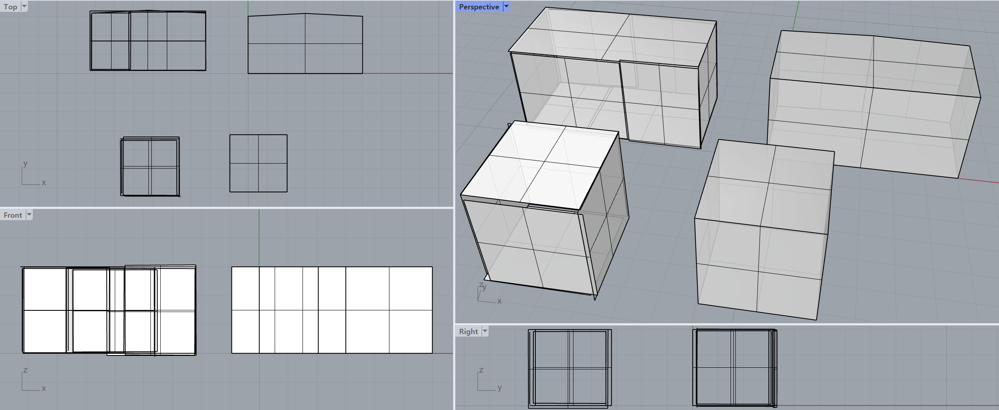

# join polygons — joining library for planar polygons

3D planar polygons extracted from point clouds (indoor/outdoor scans) via
vectorization algorithm never touch exactly: scan density and noise leave gaps and overlaps
along adjacent boundaries. This library reconstructs geometrically exact
contacts between polygons whose boundaries lie within a join tolerance
(default 0.2 m), using computational-geometry operations instead of meshing.

<p align="center">
   </img>
</p>

## Supported contact combinations

| Contact type | Example | Operation |
|---|---|---|
| 1:1 crossing planes | wall ↔ floor edge | extend/trim boundary onto the plane–plane intersection line |
| Triple-plane corner | two walls + floor | snap vertices of all three polygons to the common line–line intersection point (watertight corner) |
| Coplanar N:1 / N:N | floor delivered as several slabs on one plane | 2D boolean **union** with gap-closing (merge — intersection is undefined for parallel planes) |
| Cross-plane N:1 | several wall planes meeting one floor edge | **vertex insertion**: the shared polygon gains a vertex at each wall-to-wall transition point, so its vertex count may change |
| Non-convex neighbors | L-shaped merged floor with an inner wall | overshoot clipping is bounded to the shared adjacency span, so parts legitimately beyond the infinite line are preserved |

## Algorithm

Implemented in `polygon_join/snap.py` (`join_polygons`) and
`polygon_join/merge.py` (`merge_coplanar_polygons`):

1. **Plane fitting** — fit a least-squares (SVD) plane to every polygon and
   project its vertices onto it (`polygon_join/model.py`).
2. **Coplanar merge** — polygon pairs whose normals are within
   `plane_angle_min_deg` of parallel are tested for coplanarity: plane offset
   ≤ `join_tolerance` and 2D boundary gap ≤ `join_tolerance`. Connected groups
   are merged by a 2D union with morphological closing (buffer out → union →
   buffer in, mitred so corners stay sharp). Disconnected components remain
   separate polygons; interior holes are dropped.
3. **Adjacency detection** — for every remaining pair, intersect the two
   fitted planes. The pair is adjacent when both boundaries come within
   `join_tolerance` of the intersection line **and** their near-line spans
   overlap along the line (rejects false pairs that touch the infinite line
   at disjoint locations). The shared span is kept for clipping.
4. **Vertex insertion (N:1 support)** — in each polygon's 2D frame, compute
   the intersection points of neighbor-line pairs near their spans (triple-
   plane corner candidates). Any such corner passing through the interior of
   an edge (within tolerance, not represented by an existing endpoint) is
   inserted as a new vertex, letting e.g. a rectangular floor become a
   pentagon where two wall planes meet along one of its edges.
5. **Snapping** — each vertex near one active line is projected onto it
   (extending short boundaries, trimming long ones); a vertex near two or
   more lines snaps to their intersection, i.e. the triple-plane corner, so
   all three polygons converge on the same point.
6. **Span-bounded clipping** — material protruding past a neighbor line is
   removed, but only within the shared adjacency span (`clip_beyond_lines`).
   The kept side is chosen by area overlap, which is robust for non-convex
   merged polygons.
7. **Cleanup** — consecutive duplicates are removed (`dedupe_tolerance`) and
   collinear vertices left over from merge seams are dropped
   (`collinear_sin_tolerance`); reversal spikes are never removed silently.

## Libraries

| Library | Purpose |
|---|---|
| numpy | plane fitting (SVD), vector math |
| shapely 2.x | 2D union/clipping booleans |
| pythonocc-core 7.7 (OpenCASCADE) | STEP read/write |

## Environment / running

Use the conda environment `venv_occ` (has pythonocc-core):

```powershell
# generate example inputs (cube -> input/, room -> input_room/ + config_room.json)
& "C:\Users\MAC\.conda\envs\venv_occ\python.exe" tools\make_example.py all

# cube case: 6 faces of a 3 m cube, boundary noise +-0.15 m
& "C:\Users\MAC\.conda\envs\venv_occ\python.exe" main.py

# room case: coplanar splits + zigzag N:1 walls
& "C:\Users\MAC\.conda\envs\venv_occ\python.exe" main.py --config config_room.json

# in-memory end-to-end tests (no STEP I/O required)
& "C:\Users\MAC\.conda\envs\venv_occ\python.exe" tests\test_join.py
```

On another machine: `conda install -c conda-forge pythonocc-core shapely numpy`.

## Input / output

- **Input**: every `*.step`/`*.stp` (planar FACEs) and `*.json` file in the
  input folder.
- **Output**: `joined.step` (compound of joined FACEs) and `report.json`
  (merge groups, per-pair gaps before/after, per-polygon vertex statistics).
- JSON format:
  ```json
  { "polygons": [ {"name": "wall_0", "vertices": [[x, y, z], ...]} ] }
  ```

## config.json parameters

| Key | Default | Meaning |
|---|---|---|
| `join_tolerance` | 0.2 | join tolerance (m): max snap distance, max coplanar gap/offset |
| `plane_angle_min_deg` | 10.0 | pairs closer than this angle to parallel skip the intersection path (they become coplanar-merge candidates instead) |
| `merge_coplanar` | true | merge touching coplanar polygons via 2D union |
| `corner_snap` | true | snap vertices near two lines to the triple-plane corner |
| `corner_slack` | 1.6 | corner snap max move = tolerance × slack; also the span slack |
| `clip_beyond_lines` | true | clip overshoot past neighbor lines (span-bounded) |
| `clip_epsilon` | 1e-9 | offset that protects exactly-snapped vertices during clipping |
| `dedupe_tolerance` | 1e-7 | merge distance for duplicate vertices |
| `collinear_sin_tolerance` | 1e-8 | sine threshold for removing collinear vertices |
| `units` | "M" | STEP file unit (M = meters) |
| `input_dir` / `output_dir` / `output_filename` | – | I/O paths |

## Example results

**Cube** (6 faces, boundary noise ±0.15 m): all 12 edge pairs close to zero
gap, 8 corners each shared by exactly 3 faces (watertight), coordinates
restored exactly to [0, 3]³.

**Room** (9 polygons; see `tools/make_example.py`):
- `floor_a + floor_b` (coplanar slabs, noisy seam) → merged into one floor
- `wall_y0_a + wall_y0_b` (coplanar wall parts) → merged into one wall
- two north walls angled ~5.7° apart meet mid-span: the floor and ceiling
  were drawn as rectangles but each **gains an apex vertex** at (3, 3.15)
  through vertex insertion → exact pentagons (4 → 5 vertices)
- all 15 adjacent pairs close to zero gap; walls collapse to clean rectangles

## Library usage

```python
from polygon_join import PlanarPolygon, join_polygons
from polygon_join.step_io import read_step_folder, write_step_polygons

polys = read_step_folder("input")            # or read_json_polygons(...)
joined, report = join_polygons(polys, {"join_tolerance": 0.2})
write_step_polygons(joined, "output/joined.step")
```

## Limitations / notes

- Boundaries farther apart than the join tolerance are never considered
  adjacent (by design).
- A wall ending in the *interior* of a floor face (true T-junction through
  the face, not along its boundary) is out of scope — that requires face
  splitting, not boundary snapping.
- Interior holes of merged coplanar groups are dropped (single outer ring
  per polygon); the count is reported in `merged_groups[].dropped_holes`.
- Overshoot spikes outside the shared adjacency span are not clipped.
- Curved surfaces are not supported (planar polygons only).

# License
MIT license

# Author
Taewook Kang, Ph.d, laputa99999@gmail.com


